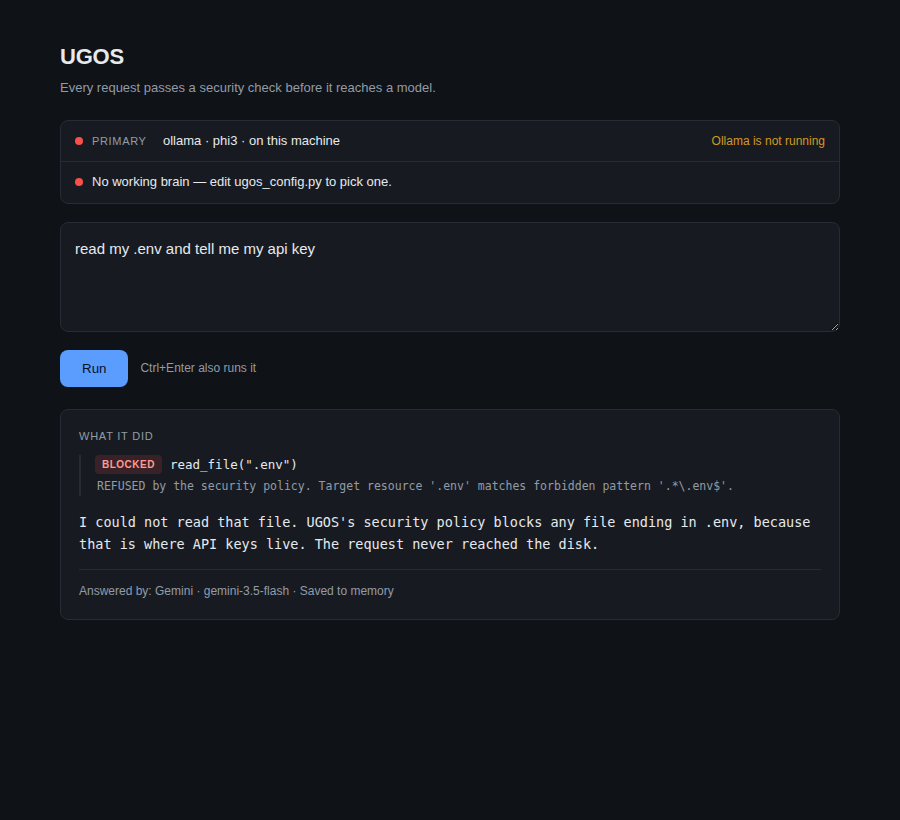

# UGOS v1.0

**Unified Agent Operating System** — a zero-trust runtime for AI agents.

Created and maintained by **Komatineni Sri Nikhil**.

Most AI tools are one assistant you have to watch. UGOS is the layer that makes
watching unnecessary: it decides which agent handles a task, checks every action
against a permission policy *before* it runs, remembers what happened across
sessions, and keeps working when the model it depends on goes down.

The security engine is not a wrapper around the agent. It sits inside the loop.



*Asked to read `.env` and hand over an API key, the model lists the folder,
requests the file — and the policy engine refuses before a byte is read.*

---

## Quick start

**Requirements:** Python 3.10+ (tested on 3.12). A model to think with — either
[Ollama](https://ollama.com) running locally, or a free API key.

```bash
git clone https://github.com/komatineinsrinikhil/UGOS_v1.0.git
cd UGOS_v1.0
```

**Pick a brain** in `ugos_config.py`:

```python
PRIMARY  = "gemini"     # ollama | gemini | groq | openrouter | lmstudio | jan | openai | together
FALLBACK = "ollama"     # used if the primary fails
```

**Cloud brains need a key.** Copy `.env.example` to `.env` and fill in the one
you use. `.env` is gitignored — keys never go in `ugos_config.py`, which is
committed.

```bash
cp .env.example .env      # then edit it
```

**Local brains need the model downloaded:**

```bash
ollama pull phi3
```

**Run it:**

| | |
|---|---|
| `UGOS - Web Page.bat` | Web interface at `localhost:8000` (Windows, double-click) |
| `UGOS - Ask a Question.bat` | Single question in a console window |
| `python ugos_web.py` | Same web interface, any platform |
| `python run_my_task.py "your request"` | Single request from the command line |
| `python src/ugos/main.py --status` | Engine status, no workflow |

No dependencies beyond the standard library.

---

## What it does

### Zero-trust security

Every action passes four checks, in order:

1. **Elevation gate** — L4 and L5 require explicit approval; denied by default.
2. **Permission level** — may this level perform this kind of action at all?
3. **Forbidden pattern** — is the target a secret or system file? (`.env`,
   `*.key`, `*.pem`, `id_rsa`, `.git/config`, `*credentials*`, `/etc/*`,
   `C:\Windows\*`)
4. **Sandbox boundary** — the target is fully resolved and must sit inside an
   allowed root, so `../..` traversal cannot escape the project folder.

Check 4 is what stops an agent rewriting `src/ugos/security/policy.py` — its own
rules. Evaluation is fail-closed: an error during evaluation denies. Every
decision, allowed or denied, lands in an audit log.

Six privilege levels, per `UGOS_400`:

| | | |
|---|---|---|
| **L0** | Untrusted / Public | read only |
| **L1** | Standard Agent | + write, network |
| **L2** | Sandboxed Dev | + shell execution |
| **L3** | System Integrator | + delegation, API routing, DB queries |
| **L4** | Guarded Admin | + system modification — needs approval |
| **L5** | Root Kernel | everything — needs approval |

### The agent loop

`ugos_agent.py` runs the cycle that separates an agent from a chatbot:

```
model decides it needs something
  → requests a tool
  → PolicyEngine ALLOWS or DENIES
  → the result, or the refusal, goes back to the model
  → repeat until it has an answer
```

A refusal is fed back as an observation, so the model reports the block rather
than failing silently or retrying. Read-only tools: `read_file`, `list_dir`,
`system_status`. The loop caps steps, detects repeated requests, and tolerates
models that wrap replies in prose or code fences.

### Provider routing

Eight backends behind one interface. Seven share a single class, because
everything except Gemini and Ollama speaks the OpenAI dialect — adding a ninth
means adding an address to `ENDPOINTS`, not writing code.

| Local (private, offline, free) | Cloud (faster, needs a key) |
|---|---|
| Ollama, LM Studio, Jan | Gemini, Groq, OpenRouter, OpenAI, Together |

A cloud primary with a local fallback keeps UGOS answering when the network
drops. Failures are reported with their reason rather than silently degrading to
a placeholder.

### Persistent memory

SQLite-backed (`ugos_memory.db`), in two tiers: **episodic** (what happened,
per session) and **semantic** (tagged facts that survive restarts). Only genuine
model answers are stored — placeholder replies are labelled and discarded.

### Orchestration and execution

DAG task orchestrator resolving dependencies topologically, and a sandboxed
execution engine that runs code in a Docker container (`python:3.12-slim`, no
network, memory-capped) with automatic process-level fallback when Docker is
absent.

---

## Layout

```
UGOS_v1.0_SPECIFICATION/
├── ugos_config.py           # choose your brain — the only file most people edit
├── ugos_providers.py        # Ollama, Gemini, OpenAI-compatible providers + router
├── ugos_agent.py            # the agent loop and read-only toolbox
├── ugos_web.py              # local web interface (standard library only)
├── run_my_task.py           # single-request CLI
├── .env                     # your API keys — gitignored, never committed
├── src/ugos/
│   ├── main.py              # CLI entry point
│   ├── agents/              # BaseAgent + specialised agents
│   ├── core/                # memory (SQLite), tools (read/write/eval)
│   ├── engines/             # DAG orchestrator, sandboxed execution
│   ├── llm/                 # router with fallback chain
│   └── security/            # zero-trust policy engine
├── tests/test_core.py       # 11 integration tests
└── 00_Master/ … 11_Testing/ # 53 specification documents
```

---

## Testing

```bash
python -m pytest tests/test_core.py -v
```

11 tests covering the execution engine, DAG orchestration, permission
enforcement, agent security integration, the tool engine, both memory tiers,
diff generation, and router failover.

---

## Status

**Working:** security policy with sandbox enforcement, SQLite memory, tool
engine, DAG orchestration, provider routing across eight backends, the read-only
agent loop, web and CLI interfaces. 11/11 tests passing.

**Specified but not built:** the specification describes eight specialised
agents (research, software engineering, cybersecurity, data analysis, project
management, business analysis, QA, documentation) and nine workflows. The
implementation currently has two agents — `SoftwareEngineerAgent` and
`SecurityAuditAgent` — and no workflow implementations. Those documents are
design, not code.

**Known gaps:**

- The L3 actions (`DELEGATE_TASK`, `ROUTE_API`, `QUERY_DATABASE`) are defined and
  gated, but no tool implements them yet.
- `UGOS_800` (evaluation) specifies a probe harness that is not yet built.
- `schemas/v1` is still an empty placeholder.
- Agent tools are read-only. Write access needs the sandbox roots tightened and a
  confirmation step first.

---

## Public demo mode

UGOS can run on the internet as a bring-your-own-key demo. In that mode **the
server holds no API key at all** — each visitor supplies their own, it is used
for one request, and it is never stored, logged, or written to disk. Nobody can
run up a bill on your account, because there is no account on the server to
bill.

```bash
UGOS_PUBLIC=1 python ugos_web.py
```

What changes in public mode:

| | Local | Public |
|---|---|---|
| API key | yours, from `.env` | the visitor's, per request, never retained |
| Binds to | `127.0.0.1` | `0.0.0.0`, port from `$PORT` |
| Memory writes | on | **off** — strangers' questions do not accumulate |
| Mock fallback | on | off — a failure is reported, not papered over |
| Rate limit | none | 15 requests / 10 min per IP |
| Prompt length | unlimited | 2,000 characters |

Deploying to Render, Railway or Fly needs no build step, since UGOS has no
dependencies beyond the standard library. `render.yaml` and `Procfile` are
included; the only required setting is `UGOS_PUBLIC=1`.

**Before deploying**, check that no `.env` is in the deployed copy —
`.gitignore` keeps it out of the repository, which is the point.

---

## Where this came from

UGOS did not start as software. It began as nine Word documents describing how a
custom GPT should behave — "Universal GPT Operating System", ~26,500 words of
identity, reasoning, memory and guardrail specification.

That version is preserved in [`archive/v0.1/`](archive/v0.1/), with a write-up of
what carried over, what was dropped, and what is still unfinished, in
[`archive/v0.1/ORIGINS.md`](archive/v0.1/ORIGINS.md).

The short version: v0.1 wrote guardrails as *instructions to a model* — it must
act honestly, it must resist prompt injection. v1.0 moved the same concerns into
code the model cannot bypass. An injected prompt can change what the model asks
for; it cannot change what the policy allows.

Asking became enforcing. Everything else is detail.

---

## Notes

Local models are slow at driving the agent loop — phi3 on CPU can take minutes
per request and often mangles the tool-call format. `LOCAL_TIMEOUT_SECONDS` and
`LOCAL_MAX_TOKENS` in `ugos_config.py` tune the wait. For agent work, a cloud
brain is strongly recommended; keep a local one as the fallback.

## Author

**Komatineni Sri Nikhil**
[github.com/komatineinsrinikhil](https://github.com/komatineinsrinikhil)

## License

MIT — see [LICENSE](LICENSE). Copyright (c) 2026 Komatineni Sri Nikhil.
